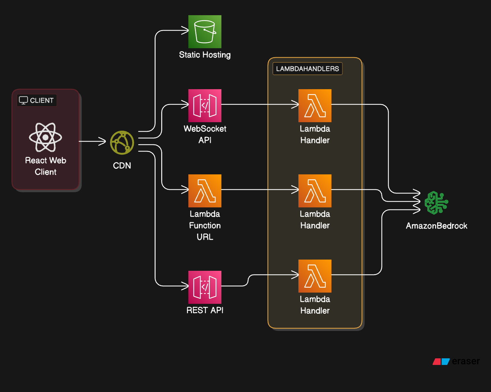

# AWS Serverless GenAI Deployment Strategies

This project demonstrates different deployment strategies for integrating Large Language Models (LLMs) using AWS Serverless services. It showcases three distinct patterns for handling AI responses: WebSocket streaming, Server-Sent Events (SSE), and traditional REST APIs.

https://github.com/user-attachments/assets/db7b01f1-bda5-4dd7-ae82-f5c5ce006549

## Architecture Overview



## Project Structure

```
.
├── infra/                     # Infrastructure components
│   └── cdn/                  # CloudFront and S3 static hosting
├── services/                  # Backend services
│   ├── realtime-ws/         # WebSocket streaming implementation
│   ├── stream-sse/          # Server-Sent Events streaming
│   ├── sync-api/           # Synchronous REST API
│   └── shared/             # Shared utilities and GenAI service
└── client/                    # Frontend application
    └── web/                 # React/TypeScript application
```

## Implementation Details

### 1. Frontend (client/web)

- React/TypeScript application with real-time streaming UI
- Comparative metrics display for each strategy
- Unified interface for all three deployment strategies

### 2. Backend Services

#### WebSocket Strategy (services/realtime-ws)

- Bidirectional communication using API Gateway WebSocket APIs
- Real-time streaming of AI responses
- Connection management and error handling
- Metrics tracking for latency and tokens

#### SSE Strategy (services/stream-sse)

- One-way server-to-client streaming
- Lambda Function URLs for direct invocation
- Efficient for long-running AI responses
- Built-in retry mechanisms

#### REST Strategy (services/sync-api)

- Traditional request-response pattern
- API Gateway REST API integration
- Suitable for shorter, non-streaming responses

### 3. Infrastructure (infra/cdn)

- CloudFront distribution for content delivery
- S3 bucket for static asset hosting
- Route handling for all three strategies
- SSM Parameter Store for configuration

### 4. Shared Components (services/shared)

- Unified GenAI service implementation
- Amazon Bedrock integration
- Common types and utilities
- Error handling patterns

## Deployment Process

### Prerequisites

- AWS Account and configured AWS CLI
- Node.js (>= 16.x)
- AWS CDK v2 (`npm install -g aws-cdk`)
- Make utility

### Bootstrap (First Time Only)

```bash
# Bootstrap CDK in your AWS account/region (run once)
make bootstrap
```

### Deployment Options

#### 1. Deploy Everything

```bash
# Deploy all components (services, CDN, and frontend)
make deploy-all OWNER=your-name@company.com
```

#### 2. Deploy Individual Components

Deploy Backend Services:

```bash
# Deploy all backend services in parallel
make deploy-services OWNER=your-name@company.com

# Or deploy services individually:
make deploy-realtime-ws OWNER=your-name@company.com
make deploy-stream-sse OWNER=your-name@company.com
make deploy-sync-api OWNER=your-name@company.com
```

Deploy Infrastructure:

```bash
# Deploy CDN and S3 infrastructure
make deploy-cdn OWNER=your-name@company.com
```

Deploy Frontend:

```bash
# Deploy frontend application
make deploy-frontend
```

### Clean Up

```bash
# Clean all deployed resources
make clean-all
```

## Key Features

1. **Real-time Streaming**

   - Immediate response initiation
   - Token-by-token streaming
   - Progress tracking
   - Connection management

2. **Performance Metrics**
   - First chunk latency
   - Total response time
   - Token generation speed
   - Comparative analysis

## Cost Considerations

- Pay-per-request Lambda pricing
- API Gateway WebSocket connection minutes
- CloudFront data transfer
- S3 storage and requests

## Contributing

1. Fork the repository
2. Create your feature branch
   ```bash
   git checkout -b feature/amazing-feature
   ```
3. Commit your changes
   ```bash
   git commit -m 'Add some amazing feature'
   ```
4. Push to the branch
   ```bash
   git push origin feature/amazing-feature
   ```
5. Open a Pull Request

## License

This project is licensed under the MIT License - see the [LICENSE](LICENSE) file for details.

## Deployment Strategy Comparison

| Metric                    | WebSocket 🔌 | SSE 📡 | REST 🌐 |
| ------------------------- | ------------ | ------ | ------- |
| First Chunk Speed         | ⭐⭐⭐       | ⭐⭐   | ⭐      |
| Average Latency           | ⭐⭐         | ⭐⭐⭐ | ⭐      |
| Total Response Time       | ⭐           | ⭐⭐⭐ | ⭐⭐⭐  |
| Timeout Handling          | ⭐⭐⭐       | ⭐⭐⭐ | ⭐      |
| AWS Integration           | ⭐⭐⭐       | ⭐     | ⭐⭐⭐  |
| Implementation Complexity | ⭐           | ⭐⭐   | ⭐⭐⭐  |
| AWS Service Support       | ⭐⭐         | ⭐     | ⭐⭐⭐  |


